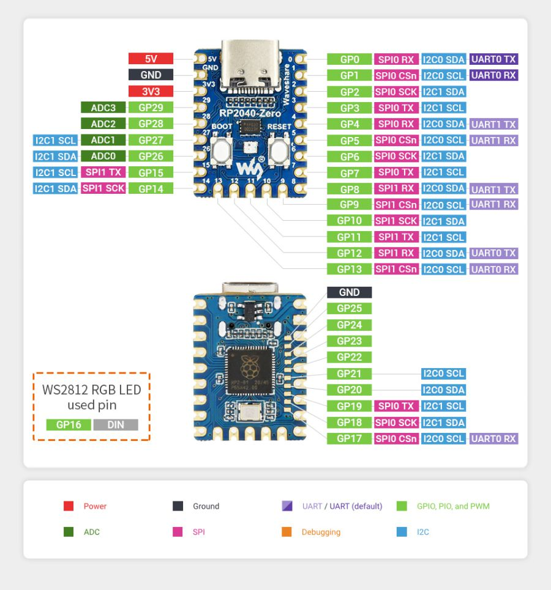
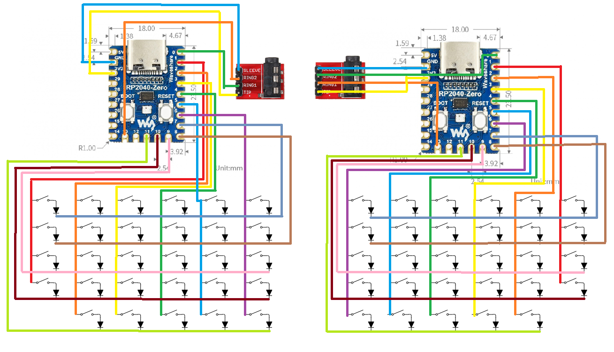

# RP2040-Zero Split Keyboard Firmware

Custom split mechanical keyboard firmware built with [KMK](http://kmkfw.io/) running on two **Waveshare RP2040-Zero** microcontrollers.



## Overview

This is a **5×6 split keyboard** (60 keys total — 30 per half) powered by CircuitPython and the KMK firmware framework. The two halves communicate over **UART** using PIO, connected via a TRRS cable.

## Hardware

| Component                 | Details                                       |
| ------------------------- | --------------------------------------------- |
| **Microcontroller**       | Waveshare RP2040-Zero × 2                     |
| **Key Matrix (per half)** | 6 columns × 5 rows, COL2ROW diode orientation |
| **Split Communication**   | UART via PIO (`GP0` TX / `GP13` RX)           |
| **Connection Cable**      | TRRS (4-pole 3.5 mm)                          |

### About RP2040-Zero

> Source: [Waveshare RP2040-Zero Wiki](https://www.waveshare.com/wiki/RP2040-Zero)

The **RP2040-Zero** is a mini development board by Waveshare featuring a USB Type-C connector and the RP2040 chip designed by Raspberry Pi. It exposes all unoccupied GPIO pins in a very compact form factor, and uses castellated pads for direct soldering onto carrier boards.

#### Specifications

| Spec             | Details                                               |
| ---------------- | ----------------------------------------------------- |
| **Processor**    | Dual-core ARM Cortex-M0+, up to 133 MHz               |
| **SRAM**         | 264 KB                                                |
| **Flash**        | 2 MB                                                  |
| **USB**          | USB 1.1 host and device support, Type-C connector     |
| **GPIO**         | 29 pins total (20 via pin headers, 9 via solder pads) |
| **On-board LED** | WS2812B RGB LED (GP16)                                |
| **PIO**          | 8 × Programmable I/O state machines                   |

#### Peripherals

- SPI × 2
- I2C × 2
- UART × 2
- 12-bit ADC × 4
- Controllable PWM channels × 16
- On-chip temperature sensor
- Hardware accelerated floating-point library

#### Official Resources

- [RP2040-Zero Schematic (PDF)](https://files.waveshare.com/upload/4/4c/RP2040_Zero.pdf)
- [RP2040-Zero STEP File (3D)](https://files.waveshare.com/upload/f/f7/RP2040_Zero_stp.zip)
- [WS2812B Test Code](https://files.waveshare.com/upload/5/58/RP2040-Zero.zip)

### Pin Mapping

#### Right Half

| Function | Pins                         |
| -------- | ---------------------------- |
| Columns  | GP6, GP5, GP4, GP3, GP2, GP1 |
| Rows     | GP7, GP8, GP9, GP10, GP11    |

#### Left Half

| Function | Pins                         |
| -------- | ---------------------------- |
| Columns  | GP1, GP2, GP3, GP4, GP5, GP6 |
| Rows     | GP7, GP8, GP9, GP10, GP11    |

### Wiring Diagram



## Firmware Features

- **KMK Framework** — Python-based keyboard firmware for CircuitPython
- **Split Keyboard** — Full two-half split support via UART/PIO
- **Multiple Layers** — Base (QWERTY) + Symbol layer with arrow keys
- **Modules Included:**
  - `Layers` — Layer switching with `MO()` keys
  - `HoldTap` — Dual-function hold/tap keys
  - `MouseKeys` — Mouse cursor control via keyboard
  - `Power` — Power management
  - `Combos` — Chord and sequence combos
  - `MediaKeys` — Volume, playback, etc.

## Keymap

### Layer 0 — BASE (QWERTY)

```
┌───────┬──────┬──────┬──────┬──────┬──────┐   ┌──────┬──────┬──────┬──────┬──────┬──────┐
│   `   │  1   │  2   │  3   │  4   │  5   │   │  6   │  7   │  8   │  9   │  0   │ BKSP │
├───────┼──────┼──────┼──────┼──────┼──────┤   ├──────┼──────┼──────┼──────┼──────┼──────┤
│  TAB  │  Q   │  W   │  E   │  R   │  T   │   │  Y   │  U   │  I   │  O   │  P   │  \   │
├───────┼──────┼──────┼──────┼──────┼──────┤   ├──────┼──────┼──────┼──────┼──────┼──────┤
│ CAPS  │  A   │  S   │  D   │  F   │  G   │   │  H   │  J   │  K   │  L   │  ;   │ ENT  │
├───────┼──────┼──────┼──────┼──────┼──────┤   ├──────┼──────┼──────┼──────┼──────┼──────┤
│  ESC  │  Z   │  X   │  C   │  V   │  B   │   │  N   │  M   │  ,   │  .   │  /   │ DEL  │
├───────┼──────┼──────┼──────┼──────┼──────┤   ├──────┼──────┼──────┼──────┼──────┼──────┤
│       │LSHIFT│ LCTL │ LGUI │ SPC  │ MO(1)│   │MO(1) │ SPC  │ RALT │ RCTL │RSHIFT│      │
└───────┴──────┴──────┴──────┴──────┴──────┘   └──────┴──────┴──────┴──────┴──────┴──────┘
```

### Layer 1 — SYM (Symbols + Navigation)

```
┌───────┬──────┬──────┬──────┬──────┬──────┐   ┌──────┬──────┬──────┬──────┬──────┬──────┐
│   `   │  1   │  2   │  3   │  4   │  5   │   │  6   │  7   │  8   │  9   │  0   │ BKSP │
├───────┼──────┼──────┼──────┼──────┼──────┤   ├──────┼──────┼──────┼──────┼──────┼──────┤
│  TAB  │  Q   │  W   │  E   │  R   │  T   │   │  Y   │  U   │  -   │  =   │  [   │  ]   │
├───────┼──────┼──────┼──────┼──────┼──────┤   ├──────┼──────┼──────┼──────┼──────┼──────┤
│ CAPS  │  A   │  S   │  D   │  F   │  G   │   │  ←   │  ↓   │  ↑   │  →   │  '   │ ENT  │
├───────┼──────┼──────┼──────┼──────┼──────┤   ├──────┼──────┼──────┼──────┼──────┼──────┤
│  ESC  │  Z   │  X   │  C   │  V   │  B   │   │  N   │  M   │  ,   │  .   │  /   │ DEL  │
├───────┼──────┼──────┼──────┼──────┼──────┤   ├──────┼──────┼──────┼──────┼──────┼──────┤
│       │LSHIFT│ LCTL │ LGUI │ SPC  │ MO(1)│   │MO(1) │ SPC  │ RALT │ RCTL │RSHIFT│      │
└───────┴──────┴──────┴──────┴──────┴──────┘   └──────┴──────┴──────┴──────┴──────┴──────┘
```

## File Structure

```
├── code.py               # Main firmware — keymap, layers, modules, split config
├── kb.py                 # Keyboard hardware definition — matrix pins & scanner
├── circuit.png           # Wiring diagram for both halves
├── RP2040-Zero.png       # RP2040-Zero pinout reference
├── splitkeyboard.stl     # 3D-printable keyboard case model
└── README.md             # This file
```

## Setup

### Prerequisites

1. Install **CircuitPython** on both RP2040-Zero boards
   - Download from [circuitpython.org](https://circuitpython.org/board/waveshare_rp2040_zero/)
2. Install **KMK** firmware
   - Follow the [KMK Getting Started Guide](https://github.com/KMKfw/kmk_firmware/blob/master/docs/en/Getting_Started.md)
   - Copy the `kmk` folder to the `CIRCUITPY` drive

### Flashing

1. Connect a RP2040-Zero via USB
2. Copy `code.py` and `kb.py` to the root of the `CIRCUITPY` drive
3. **Set the correct side** in `kb.py`:
   ```python
   isRight = True   # For the right half
   isRight = False  # For the left half
   ```
4. Repeat for the other half with the opposite `isRight` value

### 3D Printing

The `splitkeyboard.stl` file contains the 3D model for the keyboard case. Print one mirrored copy for each half.

## Customization

### Adding Layers

Edit the `keyboard.keymap` list in `code.py`. Use layer constants (`BASE`, `SYM`, `NUM`, etc.) and `KC.MO(n)` / `KC.TG(n)` to switch between layers.

### Changing Key Bindings

Modify the key entries in `keyboard.keymap`. Refer to the [KMK Keycodes documentation](https://github.com/KMKfw/kmk_firmware/blob/main/docs/en/keycodes.md) for the full list of available keycodes.

## KMK Keycodes Reference

> Source: [KMK Keycodes Documentation](https://github.com/KMKfw/kmk_firmware/blob/main/docs/en/keycodes.md)

Below is a quick reference of commonly used KMK keycodes. Key names are prefixed with `KC.` (e.g., `KC.A`, `KC.LCTL`).

### Basic Keys

| Keycode                    | Description     |
| -------------------------- | --------------- |
| `KC.A` – `KC.Z`            | Letters A–Z     |
| `KC.N0` – `KC.N9`          | Number keys 0–9 |
| `KC.F1` – `KC.F24`         | Function keys   |
| `KC.ENT` / `KC.ENTER`      | Enter           |
| `KC.ESC` / `KC.ESCAPE`     | Escape          |
| `KC.BSPC` / `KC.BACKSPACE` | Backspace       |
| `KC.TAB`                   | Tab             |
| `KC.SPC` / `KC.SPACE`      | Space           |
| `KC.CAPS`                  | Caps Lock       |

### Punctuation & Symbols

| Keycode       | Key | Keycode       | Key     |
| ------------- | --- | ------------- | ------- |
| `KC.MINUS`    | `-` | `KC.EQUAL`    | `=`     |
| `KC.LBRACKET` | `[` | `KC.RBRACKET` | `]`     |
| `KC.BSLASH`   | `\` | `KC.SCOLON`   | `;`     |
| `KC.QUOTE`    | `'` | `KC.GRAVE`    | `` ` `` |
| `KC.COMM`     | `,` | `KC.DOT`      | `.`     |
| `KC.SLSH`     | `/` |               |         |

### Modifiers

| Keycode                 | Description        | Keycode                 | Description         |
| ----------------------- | ------------------ | ----------------------- | ------------------- |
| `KC.LCTL`               | Left Control       | `KC.RCTL`               | Right Control       |
| `KC.LSFT` / `KC.LSHIFT` | Left Shift         | `KC.RSFT` / `KC.RSHIFT` | Right Shift         |
| `KC.LALT`               | Left Alt           | `KC.RALT`               | Right Alt           |
| `KC.LGUI`               | Left GUI (Win/Cmd) | `KC.RGUI`               | Right GUI (Win/Cmd) |

Modifiers can be chained: `KC.LCTL(KC.LSFT)` = hold Ctrl+Shift.

### Navigation

| Keycode   | Description | Keycode   | Description |
| --------- | ----------- | --------- | ----------- |
| `KC.UP`   | Arrow Up    | `KC.DOWN` | Arrow Down  |
| `KC.LEFT` | Arrow Left  | `KC.RGHT` | Arrow Right |
| `KC.PGUP` | Page Up     | `KC.PGDN` | Page Down   |
| `KC.HOME` | Home        | `KC.END`  | End         |
| `KC.INS`  | Insert      | `KC.DEL`  | Delete      |

### Media Keys

Requires the `MediaKeys` extension (`from kmk.extensions.media_keys import MediaKeys`).

| Keycode   | Description | Keycode   | Description    |
| --------- | ----------- | --------- | -------------- |
| `KC.MUTE` | Mute        | `KC.VOLU` | Volume Up      |
| `KC.VOLD` | Volume Down | `KC.MPLY` | Play/Pause     |
| `KC.MNXT` | Next Track  | `KC.MPRV` | Previous Track |
| `KC.MSTP` | Stop        | `KC.EJCT` | Eject          |

### Layer Switching

Requires the `Layers` module (`from kmk.modules.layers import Layers`).

| Keycode        | Description                                  |
| -------------- | -------------------------------------------- |
| `KC.MO(n)`     | Momentary — activate layer `n` while held    |
| `KC.TG(n)`     | Toggle — switch layer `n` on/off             |
| `KC.TO(n)`     | Switch directly to layer `n`                 |
| `KC.DF(n)`     | Set default layer to `n`                     |
| `KC.LT(n, kc)` | Layer-tap — tap for `kc`, hold for layer `n` |

### Special Keys

| Keycode          | Description                                |
| ---------------- | ------------------------------------------ |
| `KC.TRNS`        | Transparent — falls through to layer below |
| `KC.NO`          | No operation — blocks key                  |
| `KC.RESET`       | Reset the keyboard (enter bootloader)      |
| `KC.HT(kc, mod)` | Hold-Tap — tap for `kc`, hold for `mod`    |

## License

This project is open source. Feel free to modify and share.
